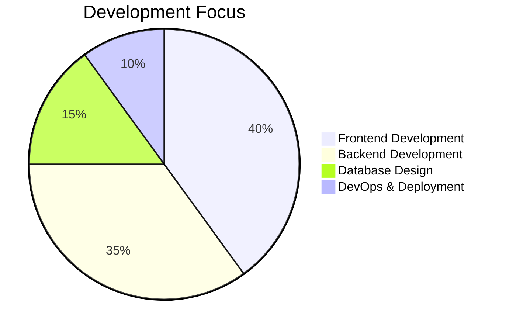

👋 Hello, I'm Arfi Putra Ramadhan

<div align="center">

https://readme-typing-svg.herokuapp.com?font=Fira+Code&pause=1000&color=00F728&width=435&lines=Passionate+Developer;Tech+Enthusiast;Problem+Solver;Continuous+Learner;Open+Source+Advocate

https://komarev.com/ghpvc/?username=arfiputraramadhan&color=blueviolet&style=flat-square
https://img.shields.io/github/followers/arfiputraramadhan?label=Follow&style=social

</div>

🧑‍💻 About Me

```javascript
const arfi = {
  pronouns: "he" | "him",
  code: ["JavaScript", "Python", "PHP", "HTML", "CSS"],
  technologies: {
    frontend: {
      frameworks: ["React", "Vue.js", "Bootstrap", "Tailwind CSS"],
      stateManagement: ["Redux", "Vuex"]
    },
    backend: {
      frameworks: ["Node.js", "Express", "Laravel"],
      databases: ["MySQL", "MongoDB", "Firebase", "PostgreSQL"]
    },
    devOps: ["Docker", "Git", "GitHub Actions", "CI/CD"],
    tools: ["VS Code", "Postman", "Figma", "Jira", "Trello"]
  },
  architecture: ["Microservices", "RESTful APIs", "MVC", "SPA"],
  currentFocus: "Advancing Full-Stack Development & Cloud Technologies",
  funFact: "I turn coffee ☕ into code 💻"
};
```

🏆 GitHub Achievements

<div align="center">

https://github-readme-stats.vercel.app/api?username=arfiputraramadhan&show_icons=true&theme=radical&include_all_commits=true&count_private=true&hide_border=true

https://github-readme-streak-stats.herokuapp.com/?user=arfiputraramadhan&theme=radical&hide_border=true

https://github-readme-stats.vercel.app/api/top-langs/?username=arfiputraramadhan&layout=compact&theme=radical&hide_border=true&langs_count=8

</div>

🛠️ Tech Stack & Skills

Programming Languages

https://img.shields.io/badge/-JavaScript-F7DF1E?style=flat-square&logo=javascript&logoColor=black
https://img.shields.io/badge/-Python-3776AB?style=flat-square&logo=python&logoColor=white
https://img.shields.io/badge/-PHP-777BB4?style=flat-square&logo=php&logoColor=white
https://img.shields.io/badge/-HTML5-E34F26?style=flat-square&logo=html5&logoColor=white
https://img.shields.io/badge/-CSS3-1572B6?style=flat-square&logo=css3&logoColor=white

Frontend Development

https://img.shields.io/badge/-React-61DAFB?style=flat-square&logo=react&logoColor=black
https://img.shields.io/badge/-Vue.js-4FC08D?style=flat-square&logo=vue.js&logoColor=white
https://img.shields.io/badge/-Bootstrap-7952B3?style=flat-square&logo=bootstrap&logoColor=white
https://img.shields.io/badge/-Tailwind_CSS-38B2AC?style=flat-square&logo=tailwind-css&logoColor=white

Backend Development

https://img.shields.io/badge/-Node.js-339933?style=flat-square&logo=node.js&logoColor=white
https://img.shields.io/badge/-Express.js-000000?style=flat-square&logo=express&logoColor=white
https://img.shields.io/badge/-Laravel-FF2D20?style=flat-square&logo=laravel&logoColor=white

Databases

https://img.shields.io/badge/-MySQL-4479A1?style=flat-square&logo=mysql&logoColor=white
https://img.shields.io/badge/-MongoDB-47A248?style=flat-square&logo=mongodb&logoColor=white
https://img.shields.io/badge/-PostgreSQL-336791?style=flat-square&logo=postgresql&logoColor=white
https://img.shields.io/badge/-Firebase-FFCA28?style=flat-square&logo=firebase&logoColor=black

Tools & Platforms

https://img.shields.io/badge/-Git-F05032?style=flat-square&logo=git&logoColor=white
https://img.shields.io/badge/-Docker-2496ED?style=flat-square&logo=docker&logoColor=white
https://img.shields.io/badge/-VS_Code-007ACC?style=flat-square&logo=visual-studio-code&logoColor=white
https://img.shields.io/badge/-Postman-FF6C37?style=flat-square&logo=postman&logoColor=white
https://img.shields.io/badge/-Figma-F24E1E?style=flat-square&logo=figma&logoColor=white

📊 Development Metrics



🚀 What I'm Currently Working On

· 🔭 Deepening my knowledge in modern JavaScript frameworks
· 🌱 Learning cloud technologies and microservices architecture
· 📚 Exploring advanced algorithms and data structures
· 💡 Experimenting with new tools and technologies
· 🎯 Improving code quality and best practices

📈 GitHub Activity Graph

<div align="center">

https://github-readme-activity-graph.vercel.app/graph?username=arfiputraramadhan&theme=react-dark&hide_border=true&area=true

</div>

📚 Learning Path

Skill Category Current Focus Next Goals
Frontend React Hooks, State Management Next.js, TypeScript
Backend API Design, Authentication Microservices, GraphQL
Database Query Optimization, Indexing Database Sharding, Replication
DevOps CI/CD Pipelines Kubernetes, AWS Services
Soft Skills Clean Code, Documentation System Design, Architecture

🏆 GitHub Trophies

<div align="center">

https://github-profile-trophy.vercel.app/?username=arfiputraramadhan&theme=onedark&no-frame=true&row=2&column=4

</div>

📫 Connect With Me

<div align="center">

https://img.shields.io/badge/-GitHub-181717?style=for-the-badge&logo=github&logoColor=white
https://img.shields.io/badge/-Portfolio-000000?style=for-the-badge&logo=google-chrome&logoColor=white
https://img.shields.io/badge/-Email-D14836?style=for-the-badge&logo=gmail&logoColor=white

</div>

💡 Random Dev Quote

<div align="center">

https://quotes-github-readme.vercel.app/api?type=horizontal&theme=radical

</div>

🎯 Development Philosophy

```yaml
Principles:
  - Write clean, maintainable code
  - Document everything
  - Test thoroughly
  - Keep learning
  - Share knowledge
  - Solve real problems

Motto: "Code is poetry when written with purpose"
```

📊 Weekly Development Breakdown

<!--START_SECTION:waka-->

<!--END_SECTION:waka-->

Note: WakaTime stats will appear here when configured

---

<div align="center">

⚡ Fun Fact:

I believe the best code is the one that never needs explanation, but I still comment everything!

Thanks for visiting my profile! ✨

https://profile-counter.glitch.me/arfiputraramadhan/count.svg

</div>
